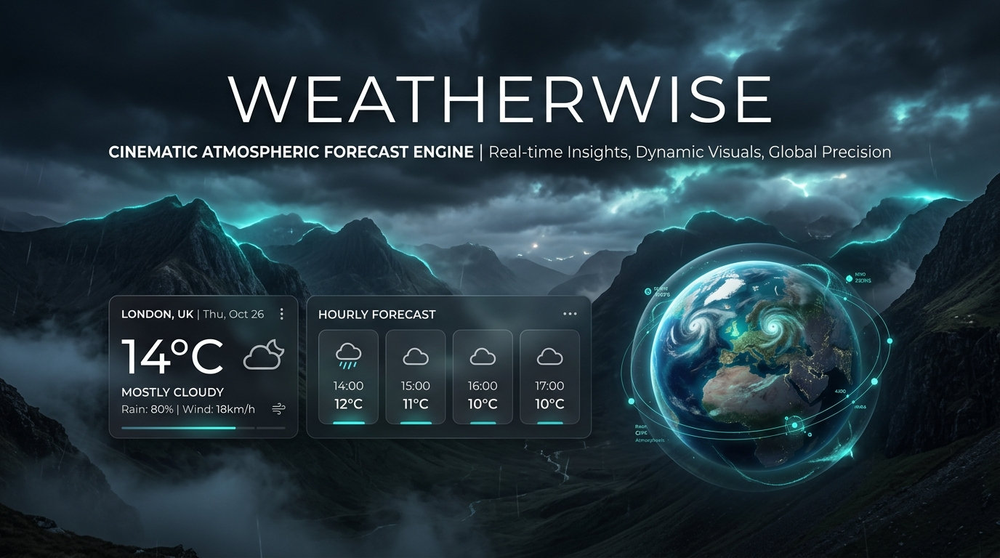

# WeatherWise 🌤️

[](https://jai1512-creator.github.io/weatherwise/)
[](https://react.dev/)
[](https://www.typescriptlang.org/)
[](https://threejs.org/)
[](https://vite.dev/)

> **A cinematic, atmospheric weather intelligence platform featuring interactive 3D WebGL globe navigation, real-time meteorological telemetry, dynamic particle simulations, and smart outdoor activity planning.**

🔗 **Live Deployment:** [https://jai1512-creator.github.io/weatherwise/](https://jai1512-creator.github.io/weatherwise/)  
📦 **GitHub Repository:** [https://github.com/jai1512-creator/weatherwise](https://github.com/jai1512-creator/weatherwise)

---

## 📸 Overview



WeatherWise transforms standard weather forecasting into an immersive digital environment. Combining real-time meteorological observation data with spatial 3D visualization and environmental rendering, WeatherWise delivers immediate clarity on local climate conditions and actionable outdoor recommendations.

---

## ✨ Key Features

### 🌍 Interactive 3D WebGL Globe
- **Precise Coordinate Pinning:** Renders the planet using Three.js and `@react-three/fiber`, accurately targeting geographic latitude and longitude with spherical trigonometric projection.
- **Orbital Camera Transitions:** Smooth mathematical lerp (linear interpolation) and quaternion rotation when switching between searched locations or user GPS coordinates.
- **Idle Motion & Interactivity:** Gentle planetary spin during idle states with immediate target alignment upon search.

### ⛅ Live Planetary Weather Telemetry
- **Accurate Real-Time Forecasts:** Powered by the open [Open-Meteo API](https://open-meteo.com/), providing temperature, apparent temperature ("feels like"), humidity, wind velocity, wind direction, UV index, atmospheric pressure, and precipitation probabilities.
- **Hourly & 7-Day Forecast Rails:** Horizon-scrolling hourly cards and detailed multi-day outlook bars with temperature distribution visualization.

### 🎬 Cinematic Atmospheric Environments
- **Dynamic Backgrounds:** Contextual high-definition video and imagery that dynamically transition according to current WMO weather codes (clear skies, partly cloudy, dense overcast, continuous rain, thunderstorms, snow, fog).
- **Astronomical Solar Grading:** Intelligent time-of-day shaders and color grading that adapt the atmosphere based on actual local dawn, daylight, golden hour evening, and night.
- **Layered Particle Engines:** Multi-plane continuous rainfall with wind drift, multi-layer snowfall, mist diffusion, and realistic lightning flashes.
- **Subtle Cursor Parallax:** Dynamic depth offset responding smoothly to pointer movement.

### 🕒 Location-Aware Local Time & Timezone
- **Astronomical Time Synchronization:** Directly parses timezone offset and local time from Open-Meteo's API for the targeted coordinates.
- **Continuous Local Clock:** Displays accurate local time and timezone abbreviations (e.g. IST, EDT, UTC) for any selected destination globally.

### 🎯 "Should I Go?" Outdoor Intelligence Engine
- **Heuristic Activity Analysis:** Multi-factor scoring engine evaluating whether weather is optimal for outdoor activities (running, cycling, hiking, photography, sports).
- **Confidence Rating & Key Factors:** Clear, transparent positive and caution factors (e.g. UV exposure, wind speed, precipitation risk, heat index).

### 🔍 Geocoding & Instant Location Search
- **Instant Autocomplete:** Fast location search with debounced geocoding queries.
- **One-Click Geolocation:** HTML5 Geolocation API coupled with BigDataCloud reverse geocoding to detect and fly to the user's current city seamlessly.

---

## 🛠️ Technology Stack

| Layer | Technologies |
|---|---|
| **Core Framework** | [React 19](https://react.dev/), [TypeScript](https://www.typescriptlang.org/) |
| **Build & Bundler** | [Vite 8](https://vite.dev/) |
| **3D & WebGL** | [Three.js](https://threejs.org/), [@react-three/fiber](https://docs.pmnd.rs/react-three-fiber), [@react-three/drei](https://github.com/pmndrs/drei) |
| **Data & APIs** | [Open-Meteo Weather API](https://open-meteo.com/), [Open-Meteo Geocoding](https://open-meteo.com/en/docs/geocoding-api), [BigDataCloud Reverse Geocoding](https://www.bigdatacloud.com/) |
| **Styling & Effects** | Pure CSS3 Glassmorphism, CSS Custom Properties, Canvas Parallax |
| **Code Quality** | ESLint 10, TypeScript ESLint |

---

## 📁 Project Architecture

```
weatherwise/
├── public/
│   ├── backgrounds/          # High-definition cinematic weather media
│   ├── favicon.svg           # Application SVG favicon
│   └── og-preview.jpg        # Open Graph & social card banner (1200x675)
├── src/
│   ├── components/
│   │   ├── environment/      # Atmospheric layers, particle simulations & parallax
│   │   │   ├── CursorParallax.tsx
│   │   │   ├── WeatherAtmosphere.tsx
│   │   │   ├── WeatherBackground.tsx
│   │   │   └── WeatherParticles.tsx
│   │   ├── globe/            # Three.js 3D WebGL Earth visualization
│   │   │   ├── Earth.tsx
│   │   │   ├── GlobeControls.tsx
│   │   │   ├── GlobeView.tsx
│   │   │   └── Marker.tsx
│   │   ├── layout/           # Header, navigation, footer, and shell
│   │   ├── search/           # Location search autocomplete & GPS button
│   │   ├── shouldigo/        # Activity recommendation engine & cards
│   │   └── weather/          # Current telemetry cards, hourly & weekly forecasts
│   ├── logic/
│   │   ├── backgroundRegistry.ts  # Weather-to-media environmental resolver
│   │   ├── recommendationEngine.ts # Outdoor suitability scoring heuristics
│   │   ├── timeOfDay.ts           # Astronomical solar time calculations
│   │   └── weatherCode.ts         # WMO weather code normalization
│   ├── services/             # Open-Meteo and reverse-geocoding API clients
│   ├── types/                # Strict TypeScript data models and interfaces
│   ├── App.tsx               # Primary application state coordinator
│   └── main.tsx              # DOM root mount
├── .github/
│   └── workflows/
│       └── deploy.yml        # Automated GitHub Pages CI/CD deployment
├── index.html                # HTML5 shell with Open Graph and SEO metadata
├── package.json
├── tsconfig.json
└── vite.config.ts            # Dynamic environment base path config
```

---

## 🚀 Getting Started

### Prerequisites
- Node.js (v18.0.0 or higher recommended)
- npm or yarn / pnpm

### Installation

1. **Clone the repository:**
   ```bash
   git clone https://github.com/jai1512-creator/weatherwise.git
   cd weatherwise
   ```

2. **Install dependencies:**
   ```bash
   npm install
   ```

3. **Start local development server:**
   ```bash
   npm run dev
   ```
   Open [http://localhost:5173](http://localhost:5173) in your browser.

4. **Build for production:**
   ```bash
   npm run build
   ```

5. **Preview production build locally:**
   ```bash
   npm run preview
   ```

---

## 🌐 Deployment

WeatherWise is configured for automated CI/CD deployment via GitHub Actions:
- Any push to `main` triggers `.github/workflows/deploy.yml`.
- The workflow builds the static bundle with Vite and deploys it directly to **GitHub Pages**.
- The build is also 100% compatible with one-click deployment on **Vercel**, **Netlify**, or any static web host.

---

## 📄 License

This project is licensed under the [MIT License](LICENSE).
